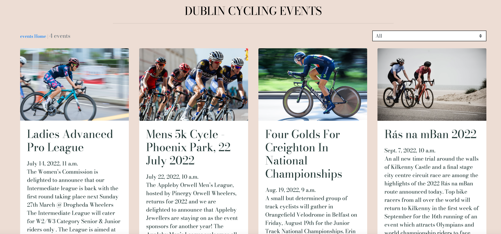
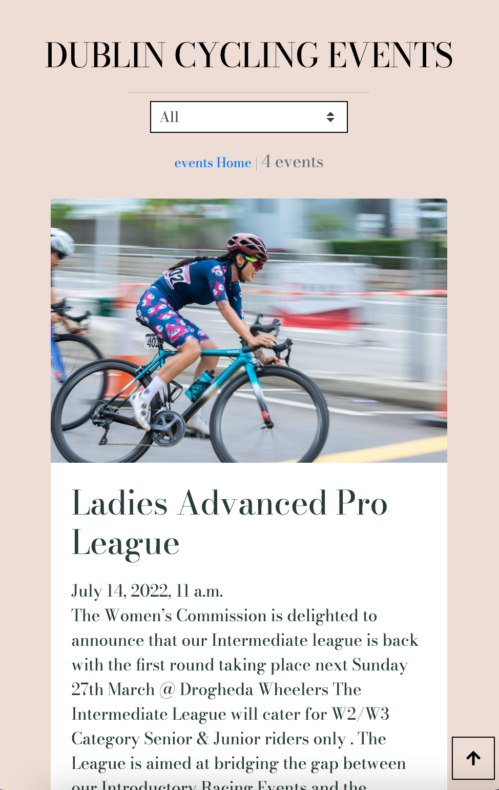

# Vélo City E-Commerce Website

## Introduction

Vélo City is an e-commerce cycling website where users can purchase bikes and cycling kit. 

There are two types of users, for which the test account details are as follows:
* Admins:
Username:
Password:

* Shoppers:
Username:
Password:

Visit the live site here: 

# User Experience (UX)

## Strategy

### Business Model

Business Model
The business model behind Vélo City is B2C or Business to Customer. The online store sells products from various cycling brands rather than their own branded products.

In terms of the flow of the business model, Vélo City buys all products from their affiliated brands and manufacturers, and these products are then sold via the Vélo City website to the customer.

### Marketing

Vélo City has a Facebook Business page which can be viewed here. This can also be accessed from the footer of the website.

The website footer also contains a Mailchimp marketing comms subscription sign up form. When users sign up to the Mailchimp form, their details feed through the company's Audience Dashboard on Mailchimp account. These customers can now be included in Vélo City marketing campaigns. 

As these marketing strategies involve the collection of user data, to ensure that Vélo City adheres to GDPR standards, there is a Vélo City Privacy Policy which can be found on the footer of the website.

### Search Engine Optimisation

This project included a Sitemap.xml and Robots.txt file to ensure that Google can crawl only the relevant and unique pages of the Vélo City website.

I have also researched the top search terms for bike store products, for which I used Google search and Wordtracker.com, in addition to reviewing other cycling e-commerce sites.

The following keywords and key phrases were included in the project meta tags:

### Project Goals

* To create an e-commerce cycling website which sells bikes and cycling kit. The site also features a cycling blog and events page which aims to attract cyclists to the site, and keep potential shoppers interested so that they might spend more time on the site.

### User Goals

* To shop for bikes and bike kit, to learn about cycling events and pick up cycling tips from our blog.

### Site Owner's Goals

* To allow users to purchase products on the site.
* To add, edit and update products on the site. 
* To add, edit and update blog posts which are published for site users.
* To add, edit and update event posts which are published for site users.
* To allow users to book a bike service via the site. 

### Site User's Goals

* To purchase bikes and cycling kit.
* To view the site blog posts for cycling tips.
* To get information about upcoming Irish cycling events via site event posts. 
* To login or logout of the site.
* To easily recover my password if I forget it
* To register as a user of the website and receive a confirmation email when doing so.
* To have a personalised profile which contains my order history, delivery and payment information.
* To sort the list of available products by category, price and rating.
* To complete a purchase of products in a shopping cart.
* To search for a product by category, name or description and view the search results.
* To view a list of products on the website.
* To view a product detail page for each product (image, price, description, category, rating and size).

### Target Audience

* Anyone who is interested in purchasing a bike or cycling kit, especially cycling enthusiasts who are likely to enjoy the cycling content, return to the site and develop brand loyalty.

## Structure

### Website Pages

The website contains the following pages: 

 * Home page

 * About page

 * Products page

 * Product detail page

 * Blog list and blog detail pages

 * Events page

 * Log in/out and register pages

 * Product Management Pages (Add, Edit and Delete)

 * Blog Managements Pages (Add, Edit and Delete)

 * Events Management Pages (Add, Edit and Delete)

 * My profile page

 * My order history page?

 * My Cart page

 * Checkout page

 * Checkout success page

For consistency of user experience, the site logo, navigation links and footer remain consitent throughout the site.

### Database

* The website uses HTML, Javascript and CSS used with the Bootstrap framework for the frontend.
* The backend was created using Python, built within the Django framework and uses the Postgres database for the deployed Heroku version.
* A SQLLite database was used for local development.

**Physical database model** 

* Post model

  * The Post model contians information about blog posts posted to the website. 
  * It contains author as a foreign-key for the users table.
  * The model contains the following fields: title, slug, author, updated_on, content, created_on, status, image_url, and image.

* Event model 

  * The Event model contains information about event listings posted to the website.
  * The model contains the following fields: title, event_category, event_date, updated_on, content, created_on, status, image_url and image.
  * The model contains multiple category types which can be chosen from a drop down menu when a post is being created.

* Booking Model
  
  * The Booking model contains information about bike service bookings made by site users.
  * The model contains the following fields: first_name, last_name, email_address, phone_number, date, and service_type. 
  * Service type field contains several choices which appear within a dropdown menu on the front-end of the site. They are: Bike fit, Repair and Full service.
  * There is a function within the model which prevents a date from the past being chosen when submitting the form.

* User Model

  * The User model contains information about the user. It is part of the Django allauth library.
  * The model contains the following fields: username, password, first_name, last_name, email, is_staff, is_active, is_superuser, last_login, date_joined.

* UserProfile Model

  * The UserProfile Model contains information about the user's profile. It has a one to one relationship with the user.
  * The model contains the following fields: user, default_phone_number, default_street_address1, default_street_address2, default_town_or_city, default_county, default_postcode, default_country.

* Product Model

 * The Product model contains information about all products on the site.
 * The model contains the the following fields: category, sku, name, description, has_sizes, price, rating, image_url and image.
 
* Category Model 

  * The Category model contains a product's category.
  * The model contains the following fields: name and friendly_name.

* Order Model 

  * The Order model contains information about a customer's order.
  * The model contains the following fields: order_number, user_profile, full_name, email, phone_number, country, postcode, town_or_city, street_Address1, street_Address2, county, date, delivery_cost, order_total, grand_total, original_cart and stripe_pid.

* OrderLineItem Model  

  * The OrderLineItem model contains information about an entry in an order, for orders made on the website.
  * The model contains Order and Product as foreign-keys.
  * The model contains the following fields: order, product, product_size, quantity and lineitem_total.

## Scope

* First Time Visitor Goals

  * As a First Time Visitor, I want to easily understand the purpose of the site.
  * As a First Time Visitor, I want to easily navigate throughout the site to find content.
  * As a First Time Visitor, I want to easily find information about the company.
 
* Returning Visitor Goals

  * As a Returning Visitor, I want to easily access and navigate to the different product links, my profile and the blog, event and booking pages.
  * As a Returning Visitor, I want to easily access the company's social media links so that I can follow them and keep up to date with news and offers.
  
* Frequent User Goals

  * As a Frequent User, I want to be able to access the site from any device including mobile, even if I am on the go.

* Site Owner Goals

  * As a site owner, I want to create an a stylish and visually appealing website which elicits a positive emotional response in users.

  * As a site owner, I want to create easy to use website where products and their categories can be easily found and purchased.

  * As a site owner, I want to convey an impression of expertise on the sport of cycling and cycling products so that I can gain customer's trust and loyalty.

  * As a site owner, I want to have a good marketing strategy, including easily found social media links and a marketing email subscription option.
 
More specific user stories are discussed in the context of website features in the Features section below.

Note: Throughout the project, this [Kanban board](https://github.com/rocrill/velo_city/projects/1) was used to organise and track the progress of the user story development, however the final user stories are documented fully within this Readme. 

## Skeleton
to do
### Wireframes
to do 
### Surface
to do 

# Features

## Existing Features

**Feature 1. Navigation bar**

  * The navigation bar is at the top and centre of all pages of the website for consistent user experience and so they can navigate easily.

  * A pointing hand icon appears over the menu links when they are hovered over for responsiveness.

  * On the drop-down menu for each main navigation link, each drop-down option is highlighted in grey when hovered over for responsiveness.

  * On mobile, the navigation menu links are within a collapsed drop down menu instead of in-line.

  Desktop:

  

  Tablet:

  

  Mobile:

  

 

User stories relating to Navigation bar and home page:

  * 1.1 As a user, I see the navigation bar with a logo on all pages and with a search box on a desktop, tablet and mobile.
  * 1.2 As a user not logged in, I see a Register/Login link in the nav bar. Clicking this leads me to the registration or sign in pages and enables me to register or sign in.
  * 1.3 As a logged in user, I am notified when I am logged in and I see a logout link in the nav which enables me to click sign out which logs me out.
  * 1.4 As a user I can view the website logo in the header at all times, and clicking this will bring me to the homepage.
  * 1.5 As a user I can click the all product, service, blog and event nav links which bring me to the relevant pages.
  * 1.6 As a user if I encounter an error on the site, an applicable error message will be shown.

**Feature 2. Home page**

  * The home page features a bike 'hero' image and a centrally placed call to action 'shop now' button which takes the user to the all products page.

  Desktop:

  

  Mobile:

  

User stories relating to the Home page:

  * 2.1 As a user, I want to see a homepage to contain a navigation bar and footer which clearly direct me to all available site pages.
  * 2.2 As a user, I want to see call to action button which directs me to the primary purpose of the site - to shop.
  
**Feature 3. All products page**

  * The all products page is neat and well-proportioned with 4 product cards spanning the width of the page. Each product card contains the product name, rating, price and category label. 
  * The all products page is paginated so that when more than 8 products are added to the site, the button appears directing the user to a second page of additional products, and so on.
  * The mobile all products page is adjusted to feature one column of prodct cards across, and eight cards appear before thr pagination button is displayed. 
  * There is a sorting drop-down menu on the top of the page which allows the user to sort products by price (low to high), price (high to low, name (A-Z), name (Z-A), rating (high to low), rating (low to high), category (A-Z) and category (Z-A).

  Desktop:

  
  

  Mobile:

  
  

User stories relating to the All Products page:

  * 3.1 As a user, I want to see a neatly displayed list of products with visually appealing images, clearly listing the name, price, category and rating of each product so I can decide on which products to view more detail on based on whether they are popular, relevant and within my price range.
  * 3.2 As a user if there are more than 8 products on the page, the page is paginated in order to maintain the neat look of the site and to avoid endless scrolling for the user.
  * 3.3 As an admin, I want to be able to edit or delete products from the all products page.

**Feature 4. Category-specific product page**

  * The navigation menu contains drop-down options to all product categories for bikes and clothing which directs the user to a category specific product page, e.g. Vintage Bikes. The page layout for each category is the same as the all products page on desktop and mobile. The product cards contain the same information, and users can sort by the same options.
  * When on a category-specific product page, the category is displayed in a box at the top of the page so that the user is aware which specific product page they are on.

  Desktop:

  

  Mobile:

  

  User stories relating to the category-specific products page:

  * 3.1 As a user, I want to be able to easily access a catergory-specific product page so that I can access the content that I am interested in quickly and easily.

**Feature 5. Product Detail page**

  * This contains a product image, description, price, category label, and rating.
  * Beneath the description there is a dropdown menu to select the size of the item. Underneath this there is a link to a size guide pdf for bikes and clothing. 
  * Beneath the size selection there is a button to select the quantity of the item you would like, and a button to add this to your shopping cart.
  * Links to edit and delete the post will also appear here if an admin user is logged in.
  * At the bottom od the page is a 'You May Also Like' recommended products feature. This displays other products within the same category that the user may be interested in.

 Desktop:

  
  

  Mobile:

  
  

  Size Chart:
 

  User stories relating to the product detail page:
  
  * 5.1 As an admin user, I want to be able to edit or delete a product from the detail page so that I can easily edit products as an admin.
  * 5.2 As a user, I want to be able to view all product information on the product detail page including an image, price, rating, category, description and size.
  * 5.3 As a user, I want to be able to view a size chart for the product I am interested in so that I can be sure I am selecting the correct size for myself.
  * 5.4 As a user, I want to be able to select the quantity of items I want and put a product in my shopping cart directly from the product detail page so that I can shop efficiently.

**Feature 6. Service Booking page**

* This page contains a description of Vélo City's service offering and a form for the user to request their desired service.
* The service booking form contains a dropdown of available service types and a calendar widget to select the desired service date.
* Once a user submits the form requesting the service, they receive a notification that the form is submitted, and that a member of the Vélo City team will be in touch to confirm their appointment.

  Desktop:

  

  Mobile:

  

  User stories relating to the Service Booking page:
  
  * 6.1 As an user, I want to be able to book a bike service easily and efficiently, so that I can arrange to resolve an issue with my bike quickly and easily.
  * 6.2 As a user, I want to receive a confirmation message so I know that I have successfully submitted my booking form.
  * 6.3 As a user, I want to receive a notification if I have accidentally selected a booking date in the past so I know that I need to fill out the form again.

**Feature 7. Blog**

* Vélo City contains a blog which offers cycling tips and guides. The aim of the blog is to position Vélo City as an expert in the world of cycling and to attract cyclists to the site for blog posts, who will then be introduced to the business and its product offering.
* The blog post list is paginated so when more than three posts are published a button appears to continue to the next page of posts.

  Desktop blog post list page:

  
  

  Desktop blog post detail page:

  
  
  

  Mobile blog post list page:

  

  Mobile blog post detail page:

  
  

  User stories relating to the Blog:
  
  * 7.1 As an user, I want to be able to access blog content with cycling tips and guides so that I can improve my knowledge of cycling and become a better cyclist.

**Feature 8. Events Page**

  * Vélo City contains an events page which lists upcoming cycling events which may be of interests to our site users. These incude events that Vélo City is a part of, as well as cycling events around Ireland. 
  * There are four categories of events: Mens cycling, Ladies cycling, Racing and Social events. Users can filter the events by category.
  * The Events list is displayed in order of the nearest event date first so that users can see what event is the soonest straight away.

  Desktop event list page:

  

  Mobile event list page:

  
  
  User stories relating Events list:

  * 8.1 As an user, I want to see a list of upcoming Irish cycling events so that I can engage with the cycling community and potentially take part in competitive events.

**Feature 9. Shopping Cart and Checkout**

* If the user has not added an item to the cart and they navigate to the cart page, they see a message that the cart is empty.
* The user can add items to their shopping cart as they are shopping. They receive notifications when they have done so. 
* The shopping cart shows an image of each item added, along with its quantity and price. The subtotal of all items is also calculated.
* On the shopping cart page the user can reduce or the increase quantity of each item, or remove the item completely. 
* An order over €50 entitles the shopper to free delivery, the delivery charge is automatically calculated at the checkout page.
* Once an order is made, the user receives a confirmation email.
* The fields on the checkout page are: Full Name, email address, phone number, and address and Country fields. This information is populated from 'my profile' if filled in.
* Even if a user is not logged in, they can add products to their bag and proceed to checkout.

  Desktop checkout page:

  
  
  Mobile checkout page:

  
  
  User stories relating to the shopping cart and checkout:

  * 9.1 As a user, I can click on a product, select a size and quantity and add it to my bag (receiving a notification when I've done so) in order to purchase it. 
  * 9.2 As a user, I can click on the cart icon and be brought to my bag to see the contents in order to know what I have selected so far and the subtotal. If no contents are there, I will see a message that the cart is empty.
  * 9.3 As a user, I can update the quantity or remove an item from my shopping bag.
  * 9.4 As a user, I can click on the Secure Checkout button on the cart page or toast message, and will be directed to the checkout page.
  * 9.5 As a user, I can fill in my personal information, or have it auto-populated if it is already filled in on my profile.
  * 9.6 As a user I can view an order summary with a subtotal of all items in cart and which includes a calculated delivery charge.
  * 9.7 As a user I can enter my credit card payment information to make a purchase.
  * 9.8 As a user on the checkout page, if I click 'Complete Order' and the transaction is unsuccessful for some reason, a message will be displayed.
  * 9.10 As a user who has completed a successful purchase, my order details will be displayed on my profile page.
  * 9.11 As a user who has completed a successful purchase, I will receive a confirmation email.
  * 9.12 As a user, I do not need to be logged in to make a purchase.

**Feature 11. User Profile Page**

* order shows up

**Feature 12. Admin CRUD pages for Products, Events and Blog**

* 

**Feature 13. Admin**

want to view bookings

